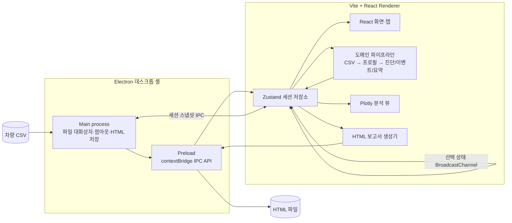

# MF Log Analyzer

Formula Student 차량에서 수집한 CSV 데이터 로그를 주행 후 검토하기 위한 데스크톱 분석 도구입니다. Electron 안에서 Vite·React UI를 실행하며, 차량 프로필에 정의된 센서 매핑·보정·임계값을 적용해 로그 품질, 차량 상태, 운전자 입력과 차량 반응을 한 화면 흐름으로 확인할 수 있습니다.

이 저장소의 현재 구현은 CSV를 불러와 분석하고 HTML 보고서를 저장하는 기능까지 다룹니다. 지도 타일, 자동 랩 분할, PDF 내보내기, 설치 패키지 생성은 포함하지 않습니다.

## 핵심 기능

- **차량 프로필 기반 입력 처리**: 2025·2026 기본 프로필이 CSV 열 별칭, 단위, 표시 이름, 보정식, 유효 범위, 이벤트 규칙과 보고서 섹션을 정의합니다.
- **로그 요약**: 기록 시간 범위, 최고 속도, 최고 RPM, 보정 가속도, 오일 온도·압력, 경고·치명 이벤트 수를 집계합니다.
- **데이터 신뢰도 진단**: 센서 열 누락, 숫자 데이터가 없는 열, 비증가 타임스탬프, 저전압, ADXL 원시 스케일 이상 징후를 표시합니다.
- **규칙 기반 이벤트**: 고회전·저유압, 저전압, 높은 횡가속도를 지속 시간 조건과 함께 탐지하고 이벤트 구간을 생성합니다.
- **연동 분석 화면**: Summary, Log Diagnostics, Time-Series Graph, Vehicle Behavior, Map / Lap, Report, Settings 탭을 제공하고 Electron 팝아웃 창 사이에서 세션 스냅샷과 선택 상태를 공유합니다.
- **HTML 보고서**: 활성 프로필이 선택한 섹션만 미리보기하고 파일로 저장합니다. 요약, 진단, 이벤트, 오버레이 설명, 차량 거동, 좌표 경로, 구간 표를 프로필 설정에 따라 구성합니다.

## 지원 입력과 데이터 흐름

입력은 헤더 행이 있는 CSV 파일입니다. Papa Parse가 문자열 형태의 원본 행과 헤더를 읽고, 선택한 차량 프로필이 각 소스 열을 표준 채널로 변환합니다. 빈 값이나 숫자로 변환할 수 없는 값은 `null`로 처리합니다.

- 시간 열 별칭: `Timestamp`, `Time`, `Time_s`
- 속도: `GPS_Speed_KPH` 또는 `GPSSpeed_KPH`, 필요 시 `VSS_kmh` 사용
- 2025 엔진 오일 유입 온도: `EOT_IN` 또는 `OilTemp_C`
- ADXL 가속도: `ax_g`, `ay_g`, `az_g`를 0.125배 한 보정 채널 제공
- 2026 추가 채널: 전후좌우 서스펜션 변위, 피토 차압·대기 속도, 조향각
- GPS 좌표: 유한한 `Longitude`·`Latitude` 쌍만 오프라인 좌표 플롯에 사용

```text
CSV 파일 선택
  -> Papa Parse로 헤더·원본 행 파싱
  -> 2025/2026 차량 프로필의 별칭·보정 적용
  -> 숫자 시계열과 원본 CSV를 Zustand 세션에 보관
  -> 진단 + 임계값 이벤트 + 요약 + 이벤트 구간 계산
  -> 탭/팝아웃 시각화
  -> 프로필 섹션에 따른 HTML 보고서 생성·저장
```

프로필을 바꾸거나 Settings에서 유효한 프로필 JSON을 적용하면, 저장해 둔 원본 CSV에서 매핑·보정·진단·이벤트·요약을 다시 계산합니다.

## 아키텍처



- **Electron**: CSV 열기·HTML 저장 대화상자, 분석 뷰 팝아웃, 최신 세션 스냅샷 보관을 담당합니다.
- **Vite + React**: 렌더러 번들, 탭 기반 분석 UI와 보고서 미리보기를 구성합니다.
- **Zustand**: 원본 CSV, 적용 로그, 프로필, 진단, 이벤트, 구간과 현재 선택 상태를 관리합니다.
- **도메인 모듈**: 파싱, 프로필 적용, 진단, 이벤트 탐지, 요약, 구간, HTML 생성을 UI와 분리합니다.
- **Plotly**: 시계열, G-G 산점도와 자세 정보, GPS 경도·위도 경로를 렌더링합니다.

## 실제 진단과 이벤트 규칙

### 로그 진단

| 검사 | 판정 |
| --- | --- |
| 프로필 채널 누락 | 소스 별칭이 헤더에 없으면 기본 표시 채널은 `warning`, 그 외는 `info` |
| 숫자 값 없음 | 헤더는 있지만 유한한 숫자 값이 하나도 없으면 `warning` |
| 타임스탬프 순서 | 앞 행보다 크지 않은 첫 타임스탬프를 `critical`로 표시 |
| 배터리 전압 | 로그 최솟값이 11.8 V 미만이면 `warning` |
| ADXL 스케일 | 원시 횡가속도 절댓값이 6 g 초과이고 보정값이 2 g 이하이면 `info` |

### 기본 이벤트

| 이벤트 | 조건 | 최소 지속 | 심각도 |
| --- | --- | ---: | --- |
| High RPM Oil Pressure Drop | RPM > 6000 및 오일 압력 < 2.5 bar | 0.5초 | critical |
| Low Battery Voltage | 배터리 전압 < 11.8 V | 1초 | warning |
| High Lateral G | 보정 횡가속도 > 1.1 g | 0.2초 | info |

이 값들은 완전한 차량 진단 기준이 아니라 기본 프로필에 들어 있는 시작점입니다. Settings의 프로필 JSON을 통해 채널·보정·오버레이·규칙·보고서 섹션을 수정할 수 있으며, 저장 전 런타임 스키마 검증을 거칩니다.

## 시각화와 보고서

- **Time-Series Graph**: Cooling, Oil Stability, Driver Input vs Response 등의 프로필 오버레이를 Plotly 선 그래프로 표시합니다. 서로 다른 단위는 개별 Y축을 쓰고, 정규화 모드는 유한한 값을 0–100 범위로 변환합니다.
- **Vehicle Behavior**: 보정 X/Y 가속도로 G-G 산점도를 만들고, 사용 가능한 자이로 값으로 최신 자세·요 레이트 정보를 표시합니다.
- **Map / Lap**: 온라인 지도 없이 경도·위도 좌표를 Plotly 선·마커로 연결하고 GPS 속도 또는 VSS 대체값으로 점을 색칠합니다. 탐지 이벤트 구간과 사용자가 입력한 수동 구간을 목록으로 보여줍니다.
- **Report**: 생성된 HTML을 `iframe`으로 미리보고 Electron 저장 대화상자를 통해 `.html` 파일로 기록합니다. 파일명, 프로필명·리비전과 사용자 데이터는 HTML 이스케이프 처리됩니다.

## 실행과 검증

Node.js와 npm이 필요합니다. Windows PowerShell에서 실행 정책으로 `npm.ps1`이 차단되면 `npm.cmd`를 사용합니다.

```powershell
npm.cmd install
npm.cmd run electron:dev
```

검증 명령의 실제 범위는 다음과 같습니다.

| 명령 | 범위 |
| --- | --- |
| `npm test` | Vitest로 프로필 적용, 진단, 이벤트, 요약·보고서, Zustand 세션과 React UI 단위/통합 테스트 실행 |
| `npm run lint` | 별도 스타일 린터가 아니라 `tsc -b --pretty false`로 TypeScript 타입 검사 |
| `npm run build` | 프로젝트 타입 검사 후 Vite 렌더러 번들 및 Electron main/preload TypeScript 컴파일 |
| `npm run test:e2e` | Vite 서버를 임시 실행하고 Playwright로 CSV 로드, 주요 탭, 요약 표시, 팝아웃 호출을 확인하는 브라우저 스모크 테스트 |

E2E는 브라우저에서 Electron 브리지 API를 대체해 UI 흐름을 검증합니다. 실제 Electron 파일 대화상자나 설치된 데스크톱 패키지를 자동 검증하는 테스트는 아닙니다. 기본 포트가 사용 중이면 `PLAYWRIGHT_PORT`를 지정할 수 있고, Playwright 브라우저 대신 시스템 Chrome을 쓸 때는 `PLAYWRIGHT_USE_SYSTEM_CHROME=1`을 설정할 수 있습니다.

## 제한사항

- 지도 타일을 불러오지 않으며, Map / Lap 화면은 경도·위도 원시 좌표의 오프라인 플롯입니다.
- 랩을 자동으로 나누지 않습니다. 현재 구간은 규칙으로 탐지된 이벤트 또는 사용자의 시작·종료 시각 입력으로 만듭니다.
- 내보내기는 HTML만 지원하며 PDF 생성 기능은 없습니다.
- `npm run build`는 컴파일과 웹 자산 빌드까지 수행하지만 설치 프로그램이나 배포 패키지를 만들지 않습니다.
- 기본 임계값은 제한된 규칙 집합이며 센서 이상과 차량 고장을 완전하게 진단하지 않습니다. 실제 차량·센서에 맞춘 프로필 검증이 필요합니다.
- 저장소는 개발 단계의 분석 도구이며 production-ready 제품, 인증된 안전 진단 시스템 또는 검증된 성능 수치를 주장하지 않습니다.
- 대용량 로그를 대상으로 한 회귀 테스트는 일부 집계 경로의 안정성을 확인할 뿐, 처리 시간·메모리·최대 파일 크기에 대한 성능 보장은 아닙니다.

## 개발 과정과 검증 경계

Git 이력에는 `codex/*` 브랜치에서 스캐폴딩, 프로필, 진단, 이벤트, 시각화, 보고서, E2E 안정화가 단계적으로 구현된 기록이 있고, `docs/superpowers/`에는 설계와 구현 계획이 남아 있습니다. 이는 생성형 개발 도구의 보조를 받은 작업 과정임을 보여 주는 범위의 근거입니다. 문서의 계획이나 생성 결과를 그 자체로 정답으로 간주하지 않고, 현재 소스와 Vitest·TypeScript 빌드·Playwright 테스트, 코드 검토 결과를 기준으로 동작을 확인합니다.
