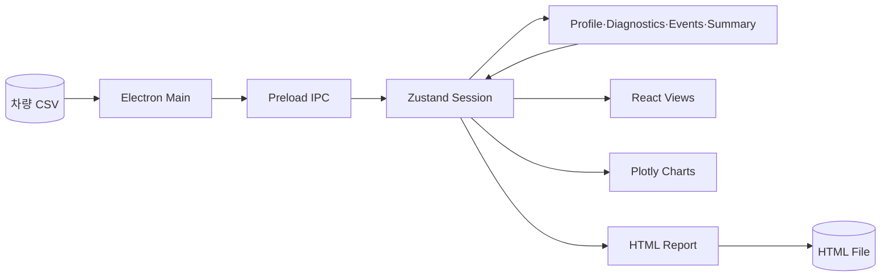

# MF Log Analyzer

Formula Student 차량에서 수집한 CSV 로그를 주행 후 검토하기 위한 Electron 기반 데스크톱 분석 도구입니다. 차량 프로필에 정의된 센서 매핑·보정·임계값을 적용해 로그 진단, 이벤트 탐지, 시각화와 HTML 보고서 생성을 수행합니다.

- 2025·2026 차량 프로필 기반 CSV 채널 매핑
- 센서 열 누락, 타임스탬프, 전압과 스케일 진단
- 지속 시간 조건을 포함한 규칙 기반 이벤트 탐지
- 시계열, G-G 분포, GPS 경로 시각화
- Electron 팝아웃 창 간 세션과 선택 상태 공유
- 프로필별 섹션을 적용한 HTML 보고서 생성
- Vitest, TypeScript build, Playwright 기반 검증

## 기술 스택

| 영역 | 기술 |
| --- | --- |
| 데스크톱 셸 | Electron |
| UI | React, Vite, TypeScript |
| 상태 관리 | Zustand |
| CSV 처리 | Papa Parse |
| 시각화 | Plotly, Three.js |
| 런타임 검증 | Zod |
| 테스트 | Vitest, Testing Library, Playwright |

## 데이터 흐름

```text
CSV 파일 선택
  -> Papa Parse로 헤더와 원본 행 파싱
  -> 차량 프로필의 별칭과 보정식 적용
  -> 숫자 시계열과 원본 CSV를 Zustand 세션에 저장
  -> 진단, 이벤트, 요약과 구간 계산
  -> 탭과 팝아웃 화면에서 시각화
  -> 프로필 설정에 따라 HTML 보고서 생성
```

입력은 헤더 행이 있는 CSV 파일입니다. 빈 값이나 숫자로 변환할 수 없는 값은 `null`로 처리합니다.

### 기본 입력 별칭

- 시간: `Timestamp`, `Time`, `Time_s`
- 속도: `GPS_Speed_KPH`, `GPSSpeed_KPH`, `VSS_kmh`
- 오일 온도: `EOT_IN`, `OilTemp_C`
- 가속도: `ax_g`, `ay_g`, `az_g`
- GPS: `Longitude`, `Latitude`
- 2026 추가 채널: 서스펜션 변위, 피토 차압·대기 속도, 조향각

프로필을 변경하면 저장된 원본 CSV에서 매핑, 보정, 진단, 이벤트와 요약을 다시 계산합니다.

## 아키텍처



- Electron main: 파일 열기·저장, 팝아웃 창, 세션 스냅샷 관리
- Preload: `contextBridge` 기반 IPC API 제공
- Domain: CSV 파싱, 프로필 적용, 진단, 이벤트, 요약과 보고서 생성
- Zustand: 원본 CSV, 프로필, 진단, 이벤트, 구간과 선택 상태 관리
- BroadcastChannel: 창 사이의 선택 상태 동기화

## 로그 진단

| 검사 | 판정 |
| --- | --- |
| 프로필 채널 누락 | 기본 표시 채널은 `warning`, 나머지는 `info` |
| 숫자 값 없음 | 유한한 숫자가 없으면 `warning` |
| 타임스탬프 순서 | 앞 행보다 크지 않으면 `critical` |
| 배터리 전압 | 최솟값이 11.8 V 미만이면 `warning` |
| ADXL 스케일 | 원시 횡가속도 6 g 초과, 보정값 2 g 이하이면 `info` |

## 기본 이벤트 규칙

| 이벤트 | 조건 | 최소 지속 | 심각도 |
| --- | --- | ---: | --- |
| High RPM Oil Pressure Drop | RPM > 6000, 오일 압력 < 2.5 bar | 0.5초 | critical |
| Low Battery Voltage | 배터리 전압 < 11.8 V | 1초 | warning |
| High Lateral G | 보정 횡가속도 > 1.1 g | 0.2초 | info |

기본값은 초기 분석 규칙이며 완전한 차량 진단 기준이 아닙니다. Settings의 프로필 JSON에서 채널, 보정식, 오버레이, 규칙과 보고서 섹션을 변경할 수 있습니다.

## 화면 구성

| 화면 | 내용 |
| --- | --- |
| Summary | 기록 시간, 최고 속도·RPM, 온도·압력, 이벤트 수 |
| Log Diagnostics | 누락 채널과 데이터 품질 진단 |
| Time-Series Graph | 프로필별 시계열 오버레이와 정규화 |
| Vehicle Behavior | G-G 산점도와 자세·요 레이트 정보 |
| Map / Lap | GPS 경로, 이벤트 구간과 수동 구간 |
| Report | HTML 미리보기와 파일 저장 |
| Settings | 차량 프로필 JSON 편집과 검증 |

Map / Lap은 온라인 지도 타일을 사용하지 않고 경도·위도 좌표를 Plotly로 표시합니다.

## 실행

Node.js와 npm이 필요합니다.

```bash
npm install
npm run electron:dev
```

Windows PowerShell에서 `npm.ps1`이 차단되면 `npm.cmd`를 사용합니다.

```powershell
npm.cmd install
npm.cmd run electron:dev
```

## 검증

```bash
npm test
npm run lint
npm run build
npm run test:e2e
```

| 명령 | 검증 범위 |
| --- | --- |
| `npm test` | 프로필, 진단, 이벤트, 요약, 보고서, 상태와 UI 테스트 |
| `npm run lint` | ESLint가 아닌 TypeScript 타입 검사 |
| `npm run build` | TypeScript와 Vite renderer, Electron main/preload 빌드 |
| `npm run test:e2e` | 브라우저 대체 브리지 기반 UI 스모크 테스트 |

현재 확인된 결과:

- Vitest: 10개 파일, 82개 테스트 통과
- TypeScript 타입 검사 통과
- production build 통과
- Playwright 스모크 테스트 1개 통과

## 제한사항

- Map / Lap은 오프라인 좌표 플롯이며 지도 타일을 제공하지 않습니다.
- 자동 랩 분할은 없으며 이벤트 또는 사용자가 입력한 시각으로 구간을 만듭니다.
- 내보내기는 HTML만 지원하며 PDF와 설치 패키지는 생성하지 않습니다.
- E2E는 실제 Electron 파일 대화상자보다 브라우저 UI 흐름을 검증합니다.
- 기본 임계값은 센서 이상과 차량 고장을 완전하게 진단하지 않습니다.
- `npm ci` 기준 의존성 취약점이 보고되므로 배포 전 의존성 검토가 필요합니다.
- 대용량 로그에 대한 최대 파일 크기와 처리 성능을 보장하지 않습니다.
